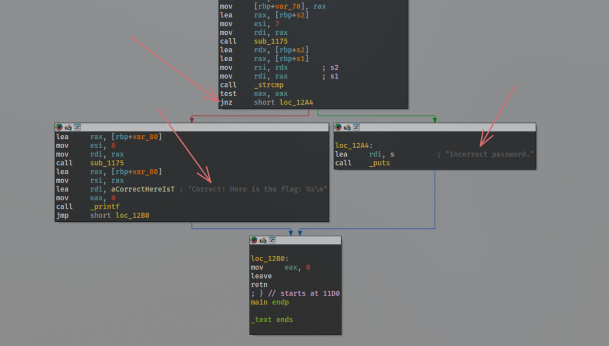
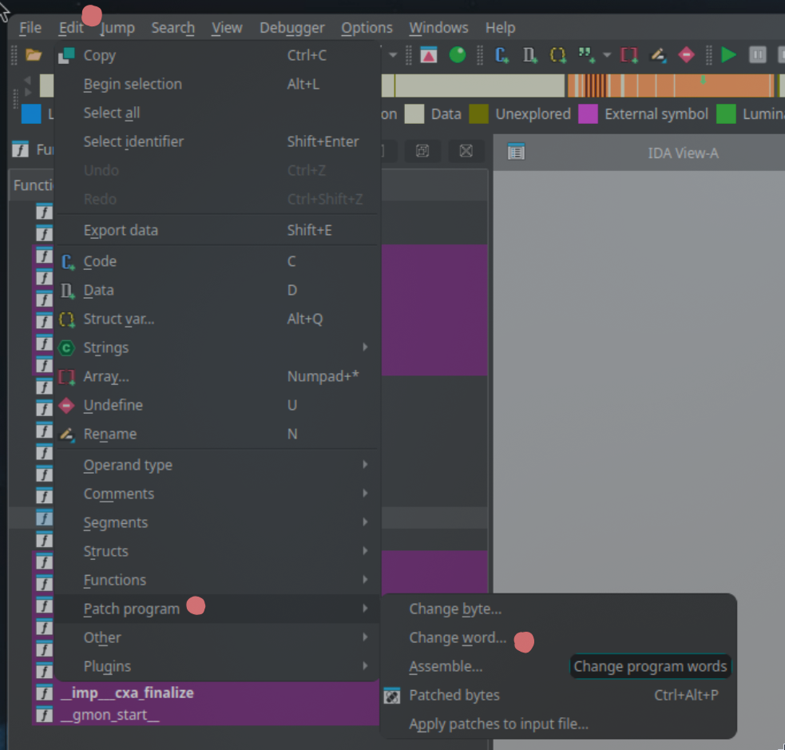
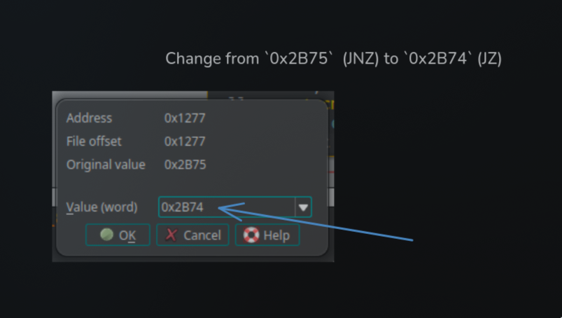
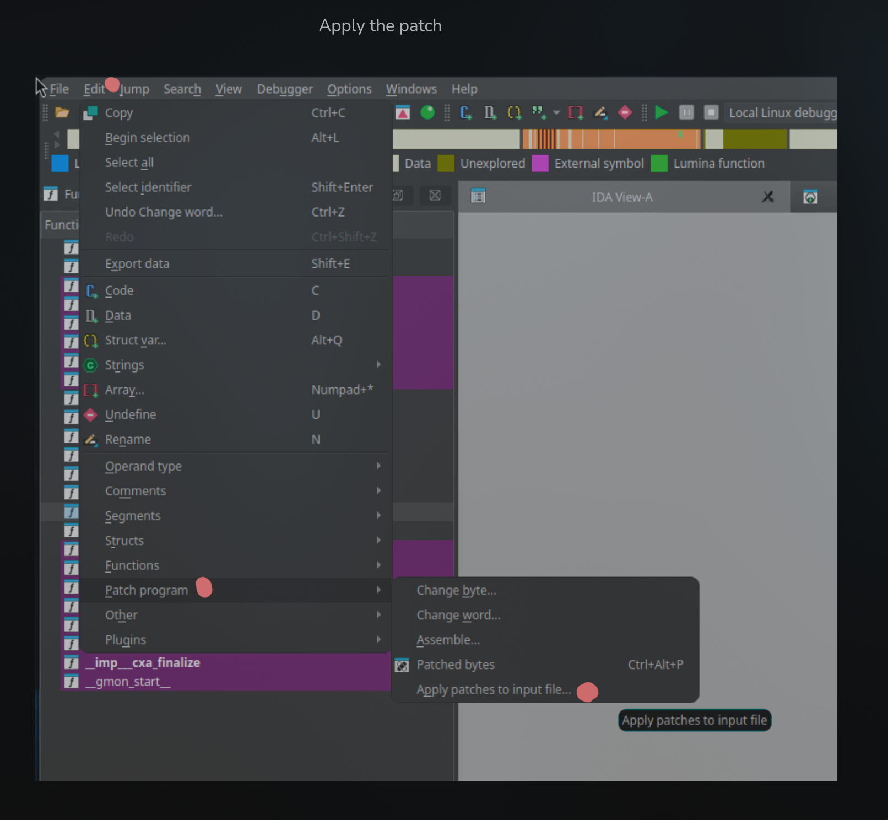
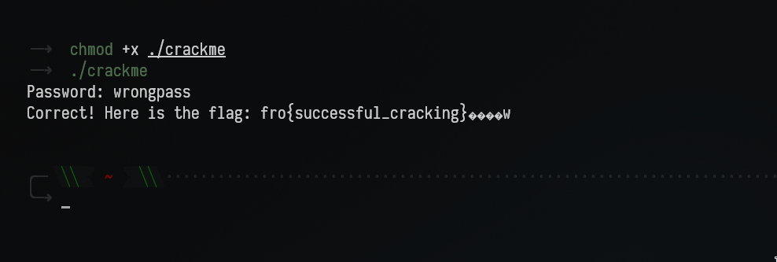

# Crack_Me
*Skriv in rätt lösenord för att få flaggan.*

## Solution
1. We're given a binary that asks for a password. Two possibilities: either we brute force the password (boring), or we dabble around in IDA and see what we can find (fun)
2. Upon looking at the main function we can see a clear junction where the code decides if it should respond with the flag or tell me the password was incorrect, a simple if-statement. The `jnz` instruction is what decides wich path to take. So, since I don't have the password I want to change the code to a `jz` instead, then it should, theoretically, give me the flag. I can patch in these changes using IDA, and boom, run the patched binary, get the flag! Eazy peasy!

## Flag
**Flag:** `fro{successful_cracking}`
